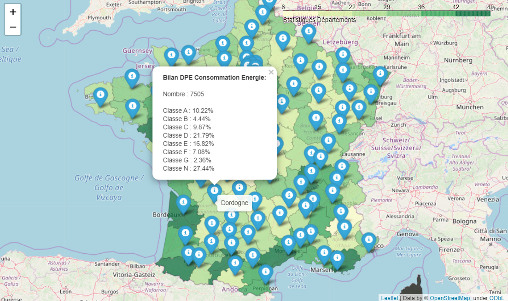
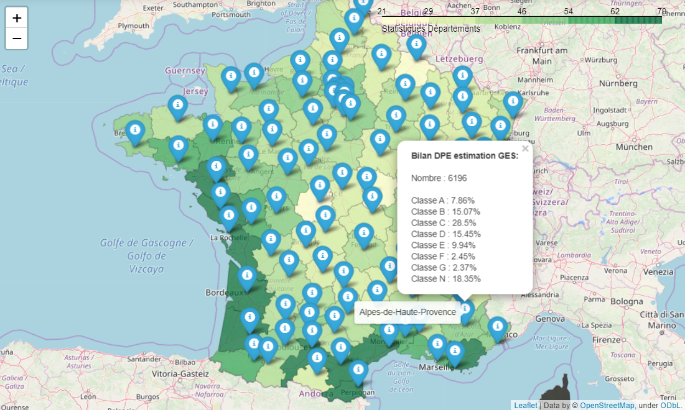

# Processing autour des données DPE

Ce repo a pour objectif de stocker l'ensemble des scripts et notebooks permettant le processing des données DPE :
- scripts d'extraction
- scripts de nettoyage des données
- scripts de montée en qualité
- scripts de geocodage

## Prétraitements

Un certain nombre de prétraitements sont réalisés sur les données (notamment du géocodage) avant de pouvoir les exploiter. Les scripts de prétraitements sont décrits [ici](data-processing/README.md)

## Prétraitements Métiers

Des traitements ont été effectués pour générer des tables annexes aux différentes tables métiers sur les systèmes énergétiques et l'enveloppe par le CSTB. Les traitements et le contenu des tables sont décrits [ici](data_processing_cstb/traitement_donnees_metier/README.md)

## Premières analyses

- Visualisation des DPE consommation d'énergie par département 

- Visualisation des DPE estimation GES par département 

Voir dossier notebooks

